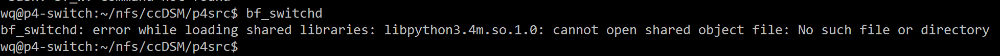
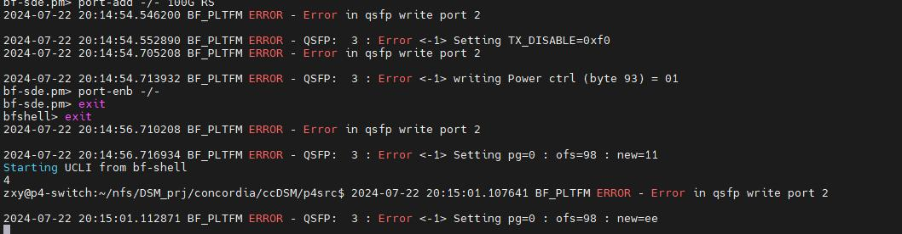

concordia仓库原名ccDSM！

重要！！！！：需要把代码中的wq改成当前用户名（e.g., zxy），然后把"/zxy/nfs/ccDSM/"改成当前工程所在目录（e.g., "/zxy/nfs/DSM_prj/concordia/ccDSM/"）

# 系统版本以及库需求
交换机：

  tofino SDE版本: bf-sde-8.2.0 (bf-sde-8.9.1实测也行)

  python-memcached：1.59

服务器：

  Ubuntu 22.04.4 LTS

  ofed版本：MLNX_OFED_LINUX-4.7-3.2.9.0 (MLNX_OFED_LINUX-23.10-2.1.3.1实测也行)

  libmemcached：1.0.18    安装指令：apt install memcached libmemcached-tools -y
  
  memcached：1.6.14       安装指令：（上一个安装指令一下装俩）
  
  Thrift：0.10.0

  如果要使用agent_stat的文件打印功能，需要执行 sudo apt-get install libboost-all-dev

# 系统相关的配置文件

1. ccDSM/host：ip、mac、p4 switch对应的port

2. NR_DIRECTORY 与 DIR_ID_MASK， NR_CACHE_AGENT 与 AGENT_ID_MASK 需要有对应关系，例如：

  NR_DIRECTORY：4

  NR_CACHE_AGENT：4

  #define DIR_ID_MASK 0x3 (注，=0b11)

  #define AGENT_ID_MASK 0x3 (注，=0b11)

3. 如果需要目录下放，需要打开 ENABLE_SWITCH_CC 宏

4. 如果需要使用highpara_benchmark.py脚本，需要配置sudo指令免密执行，完善py内的一些初始化参数和对应arp文件

5. 注意auto_run.sh和auto_run_ssh.sh中[ $up_ports == "4" ] ；其中4是等待需要up的端口数目，要按需修改（不要用脚本修改，nfs同步可能有时间差）

6. 如果出现Thrift error dirQP: TException - service has thrown: InvalidTableOperation(code=9)或Thrift error agentQP: TException - service has thrown: InvalidTableOperation(code=9)，说明dir_set_port_tbl和agent_set_tbl开小了

# 编译运行交换机代码
进入./p4src文件夹

在当前用户根目录下（e.g., /home/zxy）运行 ln -s /root/Software/bf-sde-8.9.1 bf-sde-8.9.1

检查环境变量如下：

```
# SDE
export SDE=/home/zxy/bf-sde-8.9.1
export SDE_INSTALL=$SDE/install
export PATH=$PATH:$SDE_INSTALL/bin
export LD_LIBRARY_PATH=$LD_LIBRARY_PATH:$SDE_INSTALL/lib
```

编译: ./build.sh 时间比较长

运行: sudo -E ./run.sh

运行并enable port： sudo -E ./auto_run.sh

注意auto_run.sh中[ $up_ports == "4" ] ；其中4是等待需要up的端口数目

报错信息：

1. 若出现下图generate_tofino_pd报错，可能是SDE版本不对，没能在指定位置找到相应文件


2. 若出现下图bf_switchd报错，可能是系统路径不对，需要export LD_LIBRARY_PATH=$SDE_INSTALL/lib


3. 若在运行sudo -E ./auto_run.sh时出现下图write port报错，不用在意，不影响实验


4. 交换机debug

命令行输入 bfshell 进入bfshell，输入 ucli ，然后输入 show

# 编译服务器代码
cd ccDSM/build; cmake ..; make -j;

编译C++代码，时间比较长

# 配置服务器网络（每台）

WARNING：以下配置很容易过时，请根据实际情况更改！！！！！（2025/8/20：请参考tpcc分支获取最新arp配置文件）

设置mtu为4200：sudo ifconfig enp65s0np0 mtu 4200 (已经写在arp-xxx.sh中了)

P.s., r1-r4网卡分别是 enp65s0np0, enp28s0np0, enp28s0np0, enp62s0np0

在build目录下, 加载arp条目 (需要sudo)：r1上执行sudo bash ../arp-r1.sh，r2-r3上执行sudo bash ../arp-r2-3.sh，r4上执行sudo bash ../arp-r4.sh，因为不同服务器网卡name不同

# 设置服务器大页（每台）
在build目录下：sudo bash ../hugepage.sh

# 运行服务器代码（每台）
服务器export NIC_NAME=XXXX (例如enp65s0np0)

第零步：每次运行都需要初始化p4 switch（运行sudo -E ./auto_run.sh进行初始化，进程在后台，可以通过直接运行指令bfshell查看进程是否跑着）

第一步：检查arp缓存，使用arp -a查看（里边内容需要是百G网卡的而不是普通网卡的），执行arp-*.sh解决

第二步：在r1上，在build目录下, 执行 bash ../script/restartMemc.sh，初始化memcached用于qp交换机信息 （注意，要在确保没有arp缓存问题的情况下运行）

第三步：sudo -E ./benchmark XXXX (需要sudo是因为使用了raw packet，需要root权限)

*2机*例子，原版代码：

在r1上运行sudo  -E  ./benchmark 4 4 50 0 100；

在r2上运行sudo  -E  ./benchmark 4 4 50 0 100；

*2机*例子，添加agent_stat，未开启目标链路测试：

在r1上运行sudo  -E  ./highpara_benchmark --no_node 2 --no_thread 1 --remote_ratio 50 --shared_ratio 50 --read_ratio 50 --is_cache 0 --cache_rw 0 --is_request 0 --request_rw 0 --is_home 0 --result_dir /home/zxy/concordia_result

在r2上运行sudo  -E  ./highpara_benchmark --no_node 2 --no_thread 1 --remote_ratio 50 --shared_ratio 50 --read_ratio 50 --is_cache 0 --cache_rw 0 --is_request 0 --request_rw 0 --is_home 0 --result_dir /home/zxy/concordia_result

*3机*例子，添加agent_stat，开启目标链路测试：

在r1上运行sudo  -E  ./highpara_benchmark --no_node 4 --no_thread 4 --locality 0 --shared_ratio 100 --read_ratio 50 --is_cache 0 --cache_rw 0 --is_request 0 --request_rw 0 --is_home 0 --home_node_id 2 --result_dir /home/zxy/concordia_result_2

在r2上运行sudo  -E  ./highpara_benchmark --no_node 4 --no_thread 4 --locality 0 --shared_ratio 100 --read_ratio 50 --is_cache 0 --cache_rw 0 --is_request 1 --request_rw 1 --is_home 0 --home_node_id 2 --result_dir /home/zxy/concordia_result_2

在r3上运行sudo  -E  ./highpara_benchmark --no_node 4 --no_thread 4 --locality 0 --shared_ratio 100 --read_ratio 50 --is_cache 0 --cache_rw 0 --is_request 0 --request_rw 0 --is_home 1 --home_node_id 2 --result_dir /home/zxy/concordia_result_2

在r4上运行sudo  -E  ./highpara_benchmark --no_node 4 --no_thread 4 --locality 0 --shared_ratio 100 --read_ratio 50 --is_cache 1 --cache_rw 0 --is_request 0 --request_rw 0 --is_home 0 --home_node_id 2 --result_dir /home/zxy/concordia_result_2


注意：

1. 如果发现了“XXXX: Connection timed out failed to modify QP state to RTS”

一般是arp缓存有问题，执行arp-*.sh，使用arp -a查看

如果在运行highpara_benchmark.py过程中遇到该问题（伴随show_gids发现网卡INDEX不连续（正确：0 1 2 3，错误：0 1 2 4）），记得运行kill_all.py

重要！记得检查kill_all.py中是否真的把所有机器上的原先进程都杀掉了

2. 在DSMKepper.cpp里进行了远程ssh的执行:

```c
  if (this->getMyNodeID() == 0) {
    system("ssh wq@192.168.189.34 /home/wq/nfs/ccDSM/p4src/table.py");
    system("ssh wq@192.168.189.34 /home/wq/nfs/ccDSM/p4src/mc.py");
  }
```

需要考虑sudo -E导致的ssh问题（首次建立需要ssh yes一下，不然就算把公钥放进交换机，程序也无法正确执行）

#  自动化运行
查看script/benchmark.sh，还没仔细看，应该需要看看权限问题，使用mpi跑

# 参数配置 (benchmark, highpara_benchmark)
1. sys_total_size: 所有节点总共内存空间大小（所有空间其实都是可共享的）[初始值:32GB] [当前值:16GB(开太大会导致mmap-failed？冷重启)]
2. BLOCK_SIZE: 每个节点上所有App线程会访问的总工作集空间[初始值:31MB(注:GAM的工作集为204800*512B=104MB)] [可能值:128MB]
3. SUB_PAGE_SIZE: 用户内存操作地址按该值对齐[初始值:512B]
4. STEPS: 单App线程用户发起内存操作次数[初始值:BLOCK_SIZE*nodeNR/SUB_PAGE_SIZE=253,952(4机)]
5. DSM_CACHE_LINE_WIDTH: 缓存行大小（2的幂次）[初始值:12(4KB)]
6. DSM_CACHE_INDEX_WIDTH: 缓存每个组中缓存行数目（2的幂次）[初始值:16(65536个)]
7. CACHE_WAYS：组相联缓存的行数[初始值:8]
8. DSM_CACHE_INDEX_SIZE * CACHE_WAYS: 缓存大小[初始值:2GB(注：使用的空间不与sys_total_size重合)]
9. locality: 本地内存操作有多大概率与上一次访问的地址是连续的[初始值:0]
10. sharing: 所有内存操作中，针对不共享的空间（注意：系统支持共享，但应用避开了对这部分空间的共享访问）进行访问的内存操作占比[初始值:50]
11. readNR: 所有内存操作中，读操作占比[初始值:50]
12. OP_NUM：2000000
13. DIR_MESSAGE_NR 128
13. AGENT_MESSAGE_NR 96
14. APP_MESSAGE_NR 96
14. POST_RECV_PER_RC_QP 128
14. RAW_RECV_CQ_COUNT 128

# 绑核
线程数少于12，都绑numa0

线程数=24


# 测试记录

1. （对比1）4机，4 App thread，2 Sys thread，0 Queue thread，关闭交换机下放：1217804 total-ops

2. 4机，4 App thread，8 Sys thread，0 Queue thread，关闭交换机下放：1249507(1254000) total-ops

2. 4机，16 App thread，8 Sys thread，0 Queue thread，关闭交换机下放：(测试时间很久,20分钟起步)

3. 4机，4 App thread，8 Sys thread，1 Queue thread(目录)，关闭交换机下放：190858(统计有memfence，有锁)，1223500（统计无memfence，有锁），卡住（统计无memfence，无锁）

3. 4机，4 App thread，8 Sys thread，2 Queue thread(目录与缓存)，关闭交换机下放：229498（统计无memfence，有锁）

3. 4机，4 App thread，8 Sys thread，1 Queue thread(缓存)，关闭交换机下放：218049（统计无memfence，有锁）

3. 4机，4 App thread，8 Sys thread，2 Queue thread(目录与缓存)，关闭交换机下放，ibv_poll轮询线程（2 queue-thread 与 6 sys-thread）有绑核，其他未绑核：1197398（统计无memfence，有锁）

3. 4机，4 App thread，8 Sys thread，2 Queue thread(目录与缓存)，开启交换机下放，ibv_poll轮询线程（2 queue-thread 与 6 sys-thread）有绑核，其他未绑核：1818494（统计无memfence，有锁）

3. 4机，8 App thread，8 Sys thread，2 Queue thread(目录与缓存)，开启交换机下放，ibv_poll轮询线程（2 queue-thread 与 6 sys-thread）有绑核，app threads有绑核（numa1）：486582（统计无memfence，有锁）

3. 4机，8 App thread，8 Sys thread，2 Queue thread，关闭交换机下放，app threads有绑核（numa1）：372414（统计无memfence，有锁）

3. 4机，8 App thread，8 Sys thread，2 Queue thread，关闭交换机下放，app threads有绑核（numa1），调整cacheline 512B：434766（统计无memfence，有锁）

3. 4机，4 App thread，4 Sys thread，0 Queue thread，关闭交换机下放，app threads有绑核（numa0）：1252909（统计无memfence，有锁）

3. 4机，8 App thread，4 Sys thread，0 Queue thread，关闭交换机下放，app threads有绑核（numa0）：非常慢，几十分钟了还没跑出来（统计无memfence，有锁）

3. 4机，8 App thread，2 Sys thread，0 Queue thread，关闭交换机下放，app threads有绑核（numa0）：非常慢，几十分钟了还没跑出来（统计无memfence，有锁）

3. （对比1）4机，8 App thread，4 Sys thread，0 Queue thread，关闭交换机下放，app/sys threads都在numa0：2292223

3. （对比1）4机，16 App thread，8 Sys thread，0 Queue thread，关闭交换机下放，app/sys threads都在numa0：非常慢

3. （对比1）4机，16 App thread，8 Sys thread，0 Queue thread，关闭交换机下放，sys threads在numa0，app threads在numa1：816255

3. （对比1）4机，16 App thread，8 Sys thread，0 Queue thread，关闭交换机下放，sys threads在numa0，app threads在numa1，OP_NUM修改为20000，取消打印：708284

3. （对比1）4机，16 App thread，8 Sys thread，0 Queue thread，关闭交换机下放，sys threads在numa0，app threads在numa1，OP_NUM修改为200000，取消打印：663365

3. （对比1）4机，12 App thread，8 Sys thread，0 Queue thread，关闭交换机下放，sys threads在numa0，app threads在numa1，OP_NUM修改为200000，取消打印：651208(500895)

3. （对比1）4机，12 App thread，8 Sys thread，0 Queue thread，关闭交换机下放，sys threads在numa0，app threads在numa1，OP_NUM修改为200000，取消打印, SUB_PAGE_SIZE=4096：505619(713119)

3. （对比1）4机，16 App thread，8 Sys thread，0 Queue thread，关闭交换机下放，sys threads在numa0，app threads在numa1，OP_NUM修改为200000，CACHE_LINE_SIZE=512, 取消打印：531756

3. （对比1）4机，16 App thread，8 Sys thread，0 Queue thread，关闭交换机下放，sys threads在numa0，app threads在numa1，OP_NUM修改为200000，CACHE_WAYS=16, 取消打印：757085

3. （对比1）4机，16 App thread，8 Sys thread，0 Queue thread，关闭交换机下放，sys threads在numa0，app threads在numa1，OP_NUM修改为200000，CACHE_WAYS=32, 取消打印：628442

3. （对比1）4机，12 App thread，8 Sys thread，0 Queue thread，关闭交换机下放，sys threads在numa0，app threads在numa1，OP_NUM修改为200000, 取消打印：807017

3. （对比1）4机，12 App thread，8 Sys thread，0 Queue thread，关闭交换机下放，sys threads在numa0，app threads在numa1, OP_NUM修改为200000，CACHE_LINE_SIZE=512，取消打印：500096

3. （对比1）4机，8 App thread，8 Sys thread，0 Queue thread，关闭交换机下放，sys threads在numa0，app threads在numa1, OP_NUM修改为200000，CACHE_LINE_SIZE=512，取消打印：318164

结论：concordia如果cache line设置的大，那么目录少，高并发下竞争剧烈；如果cache line设置的小，那么目录多，CC事务竞争少但数量多，网络压力增加。线程数少的时候cache line设置的大，线程数多的时候cache line要减小（也不一定减到512B，从4KB开始慢慢往下试）

xxx try to writeshared xxx, xxx fail!!!

------------------

我怎么有点怀疑是8个sys thread没有设置正确的问题，导致大量网络包丢失

3. 4机，8 App thread，4 Sys thread，0 Queue thread，关闭交换机下放，app/sys threads都在numa0：2292223
3. 4机，8 App thread，8 Sys thread，0 Queue thread，关闭交换机下放，sys threads在numa0，app threads在numa1，CACHE_LINE_SIZE=512:318164
3. 4机，8 App thread，4 Sys thread，0 Queue thread，关闭交换机下放，sys threads在numa0，app threads在numa1：284470
3. 4机，8 App thread，4 Sys thread，0 Queue thread，关闭交换机下放，app/sys threads都在numa0(重测)：2309574
3. 4机，8 App thread，4 Sys thread，0 Queue thread，关闭交换机下放，sys threads在numa0，app threads在numa1(重测)：473400
3. 4机，16 App thread，4 Sys thread，0 Queue thread，关闭交换机下放，app/sys threads都在numa0：3986750
3. 4机，16 App thread，8 Sys thread，0 Queue thread，关闭交换机下放，app/sys threads都在numa0：4072278（单长链路延迟：1253.37+28067.4+856.301=30,177=13.7）
3. 4机，16 App thread，8 Sys thread，0 Queue thread，关闭交换机下放，sys threads在numa0，app threads在numa1：821047（单长链路延迟：1417.05+24625+1049.53=27,091）
3. 4机，16 App thread，8 Sys thread，0 Queue thread，关闭交换机下放，app/sys threads都在numa0：4061637（单短链路延迟：1241.64+16619.5+875.346=18,736=8.5）

3. 4机，16 App thread，8 Sys thread，2 Queue thread，关闭交换机下放，app/无queue sys threads/queue threads都在numa0，有queue sys threads未绑核：3782383

草，等会，发现concordia绑sys thread的时候从cpu12开始倒绑，这意味着有一个sys thread会在numa1；以下为修复sys thread绑核bug的测试数据：
3. 4机，16 App thread，8 Sys thread，0 Queue thread，关闭交换机下放，app/sys threads都在numa0：4077692（差别不大，之前数据仍然可用）

发现我绑app thread的时候一部分线程从cpu12开始正绑，这意味着有一部分app thread会numa1；以下为修复app thread绑核bug的测试数据：
3. 4机，16 App thread，8 Sys thread，0 Queue thread，关闭交换机下放，app/sys threads都在numa0：3988433（差别不大，之前数据仍然可用）
3. 4机，16 App thread，8 Sys thread，0 Queue thread，关闭交换机下放，sys threads在numa0，app threads在numa1：4049124
3. 4机，24 App thread（修改MAX_APP_THREAD=24），8 Sys thread，0 Queue thread，关闭交换机下放，sys threads在numa0，app threads在numa1：卡住 (!重要：继续往小cache line的方向尝试)
3. 4机，16 App thread（修改MAX_APP_THREAD=24），8 Sys thread，0 Queue thread，关闭交换机下放，sys threads在numa0，app threads在numa1：4050315
3. 4机，16 App thread（修改MAX_APP_THREAD=24），8 Sys thread，2 Queue thread，关闭交换机下放，sys/queue threads在numa0，app threads在numa1：4007098 (ok,统计线程就这么加)

------------------
添加统计信息的相关测试
3. 4机，16 App thread（修改MAX_APP_THREAD=24），8 Sys thread，2 Queue thread，关闭交换机下放，sys/queue threads在numa0，app threads在numa1：4007098 

P50
| target cc                                         | request starts cc | request waits | request ends cc | packet in home queue | home processes | packet in cache queue | cache processes |
|---------------------------------------------------|-------------------|---------------|-----------------|----------------------|----------------|-----------------------|-----------------|
| request_type = 1, cache_init = 0, cache_type = 0  | 2807.23	          | 17355.8       | 1130.1          | 1542.29	(921.425)    | 626.414        | /                     | /
| request_type = 1, cache_init = 1, cache_type = 1  | 1525.59	          | 28801.9       | 1186.51         | 1136.77	(916.456)    | 591.744        | 898.785 (1038.45)		  | 1096.42

pure packet = 15,187
pure packet = 25,078

P99
| target cc                                         | request starts cc | request waits | request ends cc | packet in home queue | home processes | packet in cache queue | cache processes |
|---------------------------------------------------|-------------------|---------------|-----------------|----------------------|----------------|-----------------------|-----------------|
| request_type = 1, cache_init = 0, cache_type = 0  | 2500.7            | 35635.1       | 2057.5          | 3366.3 (3388.7)      | 1174.3         | /                     | /               |
| request_type = 1, cache_init = 1, cache_type = 1  | 2708.7            | 36915.1       | 2267.1          | 12377.5 (3315.1)     | 1218.3         | 3318.3 (3907.1)	      | 2268.7          |


3. 4机，1 App thread（修改MAX_APP_THREAD=24），8 Sys thread，2 Queue thread，关闭交换机下放，sys/queue threads在numa0，app threads在numa1：356174
P50
| target cc                                         | request starts cc | request waits | request ends cc | packet in home queue | home processes | packet in cache queue | cache processes |
|---------------------------------------------------|-------------------|---------------|-----------------|----------------------|----------------|-----------------------|-----------------|
| request_type = 1, cache_init = 0, cache_type = 0  | 976.97 | 16699.7 | 648.254 |

P99
| target cc                                         | request starts cc | request waits | request ends cc | packet in home queue | home processes | packet in cache queue | cache processes |
|---------------------------------------------------|-------------------|---------------|-----------------|----------------------|----------------|-----------------------|-----------------|
| request_type = 1, cache_init = 0, cache_type = 0  | 1734.3 | 25305.5 | 1002.3 |


3. 4机，1 App thread（修改MAX_APP_THREAD=24），8 Sys thread，2 Queue thread，关闭交换机下放，sys/queue threads在numa0，app threads在numa1, breakdown_times=16384：352169
P50
| target cc                                         | request starts cc | request waits | request ends cc | packet in home queue | home processes | packet in cache queue | cache processes |
|---------------------------------------------------|-------------------|---------------|-----------------|----------------------|----------------|-----------------------|-----------------|
| request_type = 1, cache_init = 0, cache_type = 0  | 957.269	| 16909.5	| 657.79 |

P99
| target cc                                         | request starts cc | request waits | request ends cc | packet in home queue | home processes | packet in cache queue | cache processes |
|---------------------------------------------------|-------------------|---------------|-----------------|----------------------|----------------|-----------------------|-----------------|
| request_type = 1, cache_init = 0, cache_type = 0  | 1626.3 | 22745.5 | 982.3 |

 

3. 4机，16 App thread（修改MAX_APP_THREAD=24），8 Sys thread，2 Queue thread，关闭交换机下放，sys/queue threads在numa0，app threads在numa1, breakdown_times=16384：3993643
P50
| target cc                                         | request starts cc | request waits | request ends cc | packet in home queue | home processes | packet in cache queue | cache processes |
|---------------------------------------------------|-------------------|---------------|-----------------|----------------------|----------------|-----------------------|-----------------|
| request_type = 1, cache_init = 0, cache_type = 0  | 1566.98	| 20442.8	| 1138.74	|

P99
| target cc                                         | request starts cc | request waits | request ends cc | packet in home queue | home processes | packet in cache queue | cache processes |
|---------------------------------------------------|-------------------|---------------|-----------------|----------------------|----------------|-----------------------|-----------------|
| request_type = 1, cache_init = 0, cache_type = 0  | 2518.3 | 30335.9 | 2180.7 |


3. 4机，18 App thread（修改MAX_APP_THREAD=24），8 Sys thread，2 Queue thread，关闭交换机下放，sys/queue threads在numa0，app threads在numa1, breakdown_times=16384：4383501
P50
| target cc                                         | request starts cc | request waits | request ends cc | packet in home queue | home processes | packet in cache queue | cache processes |
|---------------------------------------------------|-------------------|---------------|-----------------|----------------------|----------------|-----------------------|-----------------|
| request_type = 1, cache_init = 0, cache_type = 0  | 1468.65 |	18112.3	| 1097.76	|

P99
| target cc                                         | request starts cc | request waits | request ends cc | packet in home queue | home processes | packet in cache queue | cache processes |
|---------------------------------------------------|-------------------|---------------|-----------------|----------------------|----------------|-----------------------|-----------------|
| request_type = 1, cache_init = 0, cache_type = 0  | 2422.3 | 29465.5 | 2129.5 |


3. 4机，20 App thread（修改MAX_APP_THREAD=24），8 Sys thread，2 Queue thread，关闭交换机下放，sys/queue threads在numa0，app threads在numa1, breakdown_times=16384：卡住
3. 4机，20 App thread（修改MAX_APP_THREAD=24），8 Sys thread，2 Queue thread，关闭交换机下放，sys/queue threads在numa0，app threads在numa1, breakdown_times=16384，OP_NUMS=200000：卡住
3. 4机，20 App thread（修改MAX_APP_THREAD=24），8 Sys thread，2 Queue thread，关闭交换机下放，sys/queue threads在numa0，app threads在numa1, breakdown_times=16384，OP_NUMS=200000，注释try to writeshared：4789598
3. 4机，20 App thread（修改MAX_APP_THREAD=24），8 Sys thread，2 Queue thread，关闭交换机下放，sys/queue threads在numa0，app threads在numa1, breakdown_times=16384，注释try to writeshared：4765732
P50
| target cc                                         | request starts cc | request waits | request ends cc | packet in home queue | home processes | packet in cache queue | cache processes |
|---------------------------------------------------|-------------------|---------------|-----------------|----------------------|----------------|-----------------------|-----------------|
| request_type = 1, cache_init = 0, cache_type = 0  | 1530.44	| 21290.8 | 1147.76	|

P99
| target cc                                         | request starts cc | request waits | request ends cc | packet in home queue | home processes | packet in cache queue | cache processes |
|---------------------------------------------------|-------------------|---------------|-----------------|----------------------|----------------|-----------------------|-----------------|
| request_type = 1, cache_init = 0, cache_type = 0  | 2547.1 | 31359.9 | 2217.5 |

2547.1 + 31359.9 + 2217.5 =


3. 4机，22 App thread（修改MAX_APP_THREAD=24），8 Sys thread，2 Queue thread，关闭交换机下放，sys/queue threads在numa0，app threads在numa1, breakdown_times=16384，注释try to writeshared：卡住
3. 4机，20 App thread（修改MAX_APP_THREAD=24），8 Sys thread，2 Queue thread，关闭交换机下放，sys/queue threads在numa0，app threads在numa1, breakdown_times=16384，注释try to writeshared：（重试）
3. 4机，22 App thread（修改MAX_APP_THREAD=24），8 Sys thread，2 Queue thread，关闭交换机下放，sys/queue threads在numa0，app threads在numa1, breakdown_times=16384，注释try to xxx,失败事务重试间隔为指数退避，OP_NUM=200000：5252286
3. 4机，22 App thread（修改MAX_APP_THREAD=24），8 Sys thread，2 Queue thread，关闭交换机下放，sys/queue threads在numa0，app threads在numa1, breakdown_times=16384，注释try to xxx，OP_NUM=200000：5239324
3. 4机，24 App thread（修改MAX_APP_THREAD=24），8 Sys thread，2 Queue thread，关闭交换机下放，sys/queue threads在numa0，app threads在numa1, breakdown_times=16384，注释try to xxx，OP_NUM=200000：5733557
3. 4机，28 App thread（修改MAX_APP_THREAD=48, MAX_THREAD=48），8 Sys thread，2 Queue thread，关闭交换机下放，sys/queue threads在numa0，app threads在numa0和1, breakdown_times=16384，注释try to xxx，失败事务重试间隔为线性退避（fail_count/10000），OP_NUM=200000：6048218 (重试6014363)
3. 4机，32 App thread（修改MAX_APP_THREAD=48, MAX_THREAD=48），8 Sys thread，2 Queue thread，关闭交换机下放，sys/queue threads在numa0，app threads在numa0和1, breakdown_times=16384，注释try to xxx，失败事务重试间隔为线性退避，OP_NUM=200000：6827330 (重试（删了指数退避相关内容）6472483)
3. 4机，36 App thread（修改MAX_APP_THREAD=48, MAX_THREAD=48），8 Sys thread，2 Queue thread，关闭交换机下放，sys/queue threads在numa0，app threads在numa0和1, breakdown_times=16384，注释try to xxx，失败事务重试间隔为线性退避，OP_NUM=200000：卡住
3. 4机，34 App thread（修改MAX_APP_THREAD=48, MAX_THREAD=48），8 Sys thread，2 Queue thread，关闭交换机下放，sys/queue threads在numa0，app threads在numa0和1, breakdown_times=16384，注释try to xxx，失败事务重试间隔为线性退避，OP_NUM=200000：6962919
3. 4机，35 App thread（修改MAX_APP_THREAD=48, MAX_THREAD=48），8 Sys thread，2 Queue thread，关闭交换机下放，sys/queue threads在numa0，app threads在numa0和1, breakdown_times=16384，注释try to xxx，失败事务重试间隔为线性退避，OP_NUM=200000：卡住
3. 4机，34 App thread（修改MAX_APP_THREAD=48, MAX_THREAD=48），8 Sys thread，2 Queue thread，关闭交换机下放，sys/queue threads在numa0，app threads在numa0和1, breakdown_times=16384，注释try to xxx，失败事务重试间隔为线性退避：≈卡住

3. 4机，34 App thread（修改MAX_APP_THREAD=48, MAX_THREAD=48），8 Sys thread，2 Queue thread，关闭交换机下放，sys/queue threads在numa0，app threads在numa0和1, breakdown_times=16384，注释try to xxx，失败事务重试间隔为线性退避，OP_NUM=200000，添加对CC占比的统计信息：第一遍卡住，第二遍卡住

3. 4机，32 App thread（修改MAX_APP_THREAD=48, MAX_THREAD=48），8 Sys thread，2 Queue thread，关闭交换机下放，sys/queue threads在numa0，app threads在numa0和1, breakdown_times=16384，注释try to xxx，失败事务重试间隔为线性退避，OP_NUM=200000：6425207

3. 4机，32 App thread（修改MAX_APP_THREAD=48, MAX_THREAD=48），8 Sys thread，2 Queue thread，关闭交换机下放，sys/queue threads在numa0，app threads在numa0和1, breakdown_times=16384，注释try to xxx，失败事务重试间隔为线性退避，OP_NUM=200000，添加对CC占比的统计信息：6445653，卡住，卡住，6490460，观察到几乎所有的内存操作都触发了缓存一致性维护，并没有因为目录粒度粗而增加本地命中概率

3. 4机，32 App thread（修改MAX_APP_THREAD=48, MAX_THREAD=48），8 Sys thread，2 Queue thread，关闭交换机下放，sys/queue threads在numa0，app threads在numa0和1, breakdown_times=16384，注释try to xxx，失败事务重试间隔为线性退避（fail_count/100），OP_NUM=200000，添加对CC占比的统计信息：6346183

3. 4机，34 App thread（修改MAX_APP_THREAD=48, MAX_THREAD=48），8 Sys thread，2 Queue thread，关闭交换机下放，sys/queue threads在numa0，app threads在numa0和1, breakdown_times=16384，注释try to xxx，失败事务重试间隔为线性退避（fail_count/100），OP_NUM=200000，添加对CC占比的统计信息：卡住

3. 4机，32 App thread（修改MAX_APP_THREAD=48, MAX_THREAD=48），8 Sys thread，2 Queue thread，关闭交换机下放，sys/queue threads在numa0，app threads在numa0和1, breakdown_times=16384，注释try to xxx，失败事务重试间隔为线性退避，OP_NUM=200000，添加对CC占比的统计信息，添加端到端延迟打印：6.9M (发现大部分事务都没有触发缓存一致性维护？)

3. 4机，32 App thread（修改MAX_APP_THREAD=48, MAX_THREAD=48），8 Sys thread，2 Queue thread，关闭交换机下放，sys/queue threads在numa0，app threads在numa0和1, breakdown_times=16384，注释try to xxx，失败事务重试间隔为线性退避，OP_NUM=200000，添加对CC占比的统计信息，添加端到端延迟打印，DSM_CACHE_LINE=512：卡住

3. 4机，32 App thread（修改MAX_APP_THREAD=48, MAX_THREAD=48），8 Sys thread，2 Queue thread，关闭交换机下放，sys/queue threads在numa0，app threads在numa0和1, breakdown_times=16384，注释try to xxx，失败事务重试间隔为线性退避，OP_NUM=200000，添加对CC占比的统计信息，添加端到端延迟打印，不预热cache：6466733 (发现大部分事务都没有触发缓存一致性维护？)

发现是检测一次内存操作是否触发一致性维护的方法有误，目前只在readmiss和writemiss函数中统计触发了cc txn的次数

---------
开始对特定链路进行breakdown，通用配置为：4机，32 App thread（修改MAX_APP_THREAD=48, MAX_THREAD=48），8 Sys thread，2 Queue thread，关闭交换机下放，sys/queue threads在numa0，app threads在numa0和1, breakdown_times=16384，注释try to xxx，失败事务重试间隔为线性退避，OP_NUM=200000，不添加对CC占比的统计信息，添加端到端延迟打印

concordia_result_7_break_down
1. 32 App thread, request_type = 1, cache_init = 0, cache_type = 0
1. 32 App thread, request_type = 1, cache_init = 1, cache_type = 1
1. 1 App thread, request_type = 1, cache_init = 0, cache_type = 0
1. 1 App thread, request_type = 1, cache_init = 1, cache_type = 1
1. request_type = 1, cache_init = 0, cache_type = 0, request初始化为持有可读副本(跑了很多次，发现没有针对writeshared搜集统计信息导致没有async time)

concordia_result_7_break_down_v2
1. 1 App thread, request_type = 1, cache_init = 0, cache_type = 0, request初始化为持有可读副本(通过修改py脚本中的requester_run函数中的is_cache输入实现)
1. 32 App thread, request_type = 1, cache_init = 0, cache_type = 0, request初始化为持有可读副本(通过修改py脚本中的requester_run函数中的is_cache输入实现),线性退避（fail_count/100）
1. 1 App thread, request_type = 1, cache_init = 0, cache_type = 0,线性退避（fail_count/100）
1. 32 App thread, request_type = 1, cache_init = 0, cache_type = 0,线性退避（fail_count/100）
发现home节点没有计数？草，需要确保py脚本中的home node id符合启动顺序（通过sleep解决）

concordia_result_7_break_down_v3
1. 1 App thread, request_type = 1, cache_init = 0, cache_type = 0, request初始化为持有可读副本(通过修改py脚本中的requester_run函数中的is_cache输入实现)
1. 32 App thread, request_type = 1, cache_init = 0, cache_type = 0, request初始化为持有可读副本(通过修改py脚本中的requester_run函数中的is_cache输入实现),线性退避（fail_count/100）
1. 1 App thread, request_type = 1, cache_init = 0, cache_type = 0,线性退避（fail_count/100）
1. 32 App thread, request_type = 1, cache_init = 0, cache_type = 0,线性退避（fail_count/100）
1. 1 App thread, request_type = 1, cache_init = 0, cache_type = 0,线性退避（fail_count/100）, 添加统计CC事务比例
1. 32 App thread, request_type = 1, cache_init = 0, cache_type = 0,线性退避（fail_count/100）
1. 34 App thread, request_type = 1, cache_init = 0, cache_type = 0,线性退避（fail_count/100）,修改DIR_MESSAGE_NR，AGENT_MESSAGE_NR ，APP_MESSAGE_NR 值(没用，已改回)
1. 34 App thread, request_type = 1, cache_init = 0, cache_type = 0,线性退避（fail_count/100）,统计控制包和数据包的数量，修改RAW_RECV_CQ_COUNT为1024

发现4KB数据包把网络吞吐占完了。而大数据包pps低，并不容易受qp爆炸影响（qp爆炸影响的是pps，因为nic cache miss会导致后续的包等待更长的时间才能被处理）
-----------------------
concordia_result_7_break_down_v5（修改cache line size）
1. 16 App thread, request_type = 1, cache_init = 0, cache_type = 0,线性退避（fail_count/100）,统计控制包和数据包的数量，修改RAW_RECV_CQ_COUNT为1024，修改cache line size为512B: 4625556, MBps total=(613.52, 938.01), Mpps total=(8, 1.8)

1. 20 App thread, request_type = 1, cache_init = 0, cache_type = 0,线性退避（fail_count/100）,统计控制包和数据包的数量，修改RAW_RECV_CQ_COUNT为1024，修改cache line size为512B: 卡住

1. 16 App thread, request_type = 1, cache_init = 0, cache_type = 0,线性退避（fail_count/100）,统计控制包和数据包的数量，修改RAW_RECV_CQ_COUNT为1024：3975482, MBps total=(536.70, 6570.10), Mpps total=(7.2, 1.6)

1. 32 App thread, request_type = 1, cache_init = 0, cache_type = 0,线性退避（fail_count/100）,统计控制包和数据包的数量，修改RAW_RECV_CQ_COUNT为1024：6340176, MBps total=(847.46, 10163.19),	MPps total=(11.45, 2.48)

1. 18 App thread, request_type = 1, cache_init = 0, cache_type = 0,线性退避（fail_count/100）,统计控制包和数据包的数量，修改RAW_RECV_CQ_COUNT为1024，修改cache line size为512B: 5154085, MBps total=(675.93, 1029.49),	MPps total=(9.13, 2.01)

1. 19 App thread, request_type = 1, cache_init = 0, cache_type = 0,线性退避（fail_count/100）,统计控制包和数据包的数量，修改RAW_RECV_CQ_COUNT为1024，修改cache line size为512B: 5386344, MBps total=(699.29, 1065.67)	MPps total=(9.45, 2.08)

1. 20 App thread, request_type = 1, cache_init = 0, cache_type = 0,线性退避（fail_count/100）,统计控制包和数据包的数量，修改RAW_RECV_CQ_COUNT为1024，修改cache line size为512B: 5632595, MBps total=(732.83, 1125.37)	MPps total=(9.90, 2.20)

1. 22 App thread, request_type = 1, cache_init = 0, cache_type = 0,线性退避（fail_count/100）,统计控制包和数据包的数量，修改RAW_RECV_CQ_COUNT为1024，修改cache line size为512B: 6120561, MBps total=(789.35, 1201.18)	MPps total=(10.67, 2.35)

1. 24 App thread, request_type = 1, cache_init = 0, cache_type = 0,线性退避（fail_count/100）,统计控制包和数据包的数量，修改RAW_RECV_CQ_COUNT为1024，修改cache line size为512B: 6638869, MBps total=(836.34, 1267.68)	MPps total=(11.30, 2.48)

1. 26 App thread, request_type = 1, cache_init = 0, cache_type = 0,线性退避（fail_count/100）,统计控制包和数据包的数量，修改RAW_RECV_CQ_COUNT为1024，修改cache line size为512B: 卡住

1. 26 App thread, request_type = 1, cache_init = 0, cache_type = 0,线性退避（fail_count/100）,统计控制包和数据包的数量，修改RAW_RECV_CQ_COUNT为1024，修改cache line size为512B，修改DIR_MESSAGE_NR，AGENT_MESSAGE_NR为256：卡住

1. 26 App thread, request_type = 1, cache_init = 0, cache_type = 0,线性退避（fail_count/100）,统计控制包和数据包的数量，修改RAW_RECV_CQ_COUNT为16384，修改cache line size为512B：7018564, MBps total=(894.52, 1352.84)	MPps total=(12.09, 2.64)

1. 28 App thread, request_type = 1, cache_init = 0, cache_type = 0,线性退避（fail_count/100）,统计控制包和数据包的数量，修改RAW_RECV_CQ_COUNT为16384，修改cache line size为512B：卡住

1. 1 App thread, request_type = 1, cache_init = 0, cache_type = 0,线性退避（fail_count/100）,统计控制包和数据包的数量，修改RAW_RECV_CQ_COUNT为16384：（为了做ppt）

------
8机

1. 4机，24 App thread, request_type = 1, cache_init = 0, cache_type = 0,线性退避（fail_count/100）,统计控制包和数据包的数量，修改RAW_RECV_CQ_COUNT为16384：5761332

1. 5机，24 App thread, request_type = 1, cache_init = 0, cache_type = 0,线性退避（fail_count/100）,统计控制包和数据包的数量，修改RAW_RECV_CQ_COUNT为16384：6643487

1. 7机，24 App thread, request_type = 1, cache_init = 0, cache_type = 0,线性退避（fail_count/100）,统计控制包和数据包的数量，修改RAW_RECV_CQ_COUNT为16384：卡住，8619019

1. 8机，24 App thread, request_type = 1, cache_init = 0, cache_type = 0,线性退避（fail_count/100）,统计控制包和数据包的数量，修改RAW_RECV_CQ_COUNT为16384：卡住

1. 7机，24 App thread, request_type = 1, cache_init = 0, cache_type = 0,线性退避（fail_count/100）,统计控制包和数据包的数量，修改RAW_RECV_CQ_COUNT为16384，开启交换机下放：12029463

1. 8机，24 App thread, request_type = 1, cache_init = 0, cache_type = 0,线性退避（fail_count/100）,统计控制包和数据包的数量，修改RAW_RECV_CQ_COUNT为16384：卡住

1. 8机，20 App thread, request_type = 1, cache_init = 0, cache_type = 0,线性退避（fail_count/100）,统计控制包和数据包的数量，修改RAW_RECV_CQ_COUNT为16384，开启交换机下放：11578836

1. 8机，20 App thread, request_type = 1, cache_init = 0, cache_type = 0,线性退避（fail_count/100）,统计控制包和数据包的数量，修改RAW_RECV_CQ_COUNT为16384，不开启交换机下放：8292097

1. 8机，20 App thread, request_type = 1, cache_init = 0, cache_type = 0,线性退避（fail_count/100）,统计控制包和数据包的数量，修改RAW_RECV_CQ_COUNT为16384，修改DIR_MESSAGE_NR，AGENT_MESSAGE_NR为2048，不开启交换机下放， cache line size=512B：卡住

1. 8机，20 App thread, request_type = 1, cache_init = 0, cache_type = 0,线性退避（fail_count/100）,统计控制包和数据包的数量，修改RAW_RECV_CQ_COUNT为16384，不开启交换机下放， cache line size=512B：卡住

1. 4机，20 App thread, request_type = 1, cache_init = 0, cache_type = 0,线性退避（fail_count/100）,统计控制包和数据包的数量，修改RAW_RECV_CQ_COUNT为16384，修改DIR_MESSAGE_NR，AGENT_MESSAGE_NR为2048，不开启交换机下放， cache line size=512B：卡住（先观察能不能看到卡住的现象，然后用gdb attach debug）

1. 4机，1 App thread, request_type = 1, cache_init = 0, cache_type = 0,线性退避（fail_count/100）,统计控制包和数据包的数量，修改RAW_RECV_CQ_COUNT为16384，修改DIR_MESSAGE_NR，AGENT_MESSAGE_NR为2048，不开启交换机下放， cache line size=512B：卡住（先观察能不能看到卡住的现象，然后用gdb attach debug）

1. 2机(注释t3，t4，并把4+替换为2+,增加run_request中的轮次信息)，1 App thread, request_type = 1, cache_init = 0, cache_type = 0,线性退避（fail_count/100）,统计控制包和数据包的数量，修改RAW_RECV_CQ_COUNT为16384，修改DIR_MESSAGE_NR，AGENT_MESSAGE_NR为2048，不开启交换机下放， cache line size=512B, 无queue thread：卡住，所有线程都在pollwithcq

1. 2机(注释t3，t4，并把4+替换为2+,增加run_request中的轮次信息)，1 App thread, request_type = 1, cache_init = 0, cache_type = 0,线性退避（fail_count/100）,统计控制包和数据包的数量，修改RAW_RECV_CQ_COUNT为16384，不开启交换机下放， cache line size=512B, 无queue thread：卡住

1. 2机(注释t3，t4，并把4+替换为2+,增加run_request中的轮次信息)，1 App thread, request_type = 1, cache_init = 0, cache_type = 0,线性退避（fail_count/100）,统计控制包和数据包的数量，不开启交换机下放， cache line size=512B, 无queue thread：卡住

1. 2机(注释t3，t4，并把4+替换为2+,增加run_request中的轮次信息)，1 App thread, request_type = 1, cache_init = 0, cache_type = 0,线性退避（fail_count/100）,统计控制包和数据包的数量，不开启交换机下放， 无queue thread：卡住

1. 4机，1 App thread, request_type = 1, cache_init = 0, cache_type = 0,线性退避（fail_count/100）,统计控制包和数据包的数量，不开启交换机下放， 无queue thread：331889
？为什么4机能跑通2机不能跑通？？？？？？？？？
---
debug:
1. 草，为什么开着加解应用锁，则dir计数少了1/4的包（本应处理加应用锁，W-miss，W-miss-unlock，解应用锁（少了这个））；
不开加解应用锁，则dir计数正常（W-miss，W-miss-unlock）；

原因：应用锁解锁时dirkey的计算方式与其他不同

2. app threads超过8时性能贼差

原因：app threads跟sys threads都绑在了numa0上，有重合，目前已经改成app threads绑在numa1上，sys thread绑在numa0上

另注：concordia自带的bindCore函数，传入的参数core表示CPU id，在实验室集群中，CPU0-11,24-35属于numa0

3. MAX_APP_THREAD宏已存在，初始值为16，不可重复在agent_stat.h中定义; MAX_THREAD宏的值需要大于等于MAX_APP_THREAD

4. 为什么benchmark BLOCKSIZE = 256M 会卡死?


