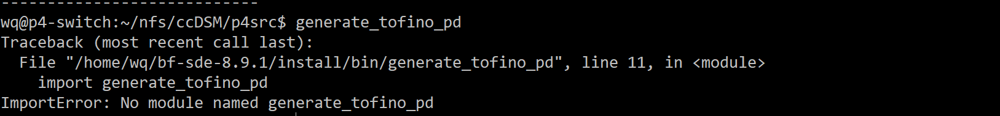

concordia仓库原名ccDSM！

需要把代码中的wq改成当前用户名（e.g., zxy），然后把"/zxy/nfs/ccDSM/"改成当前工程所在目录（e.g., "/zxy/nfs/DSM_prj/concordia/ccDSM/"）

# 系统版本以及库需求
交换机：

  tofino SDE版本: bf-sde-8.2.0 (bf-sde-8.9.1实测也行)

  python-memcached：1.59

服务器：

  Ubuntu 22.04.4 LTS

  ofed版本：MLNX_OFED_LINUX-4.7-3.2.9.0 (MLNX_OFED_LINUX-23.10-2.1.3.1实测也行)

  libmemcached：1.0.18    安装指令：apt install memcached libmemcached-tools -y
  
  memcached：1.6.14       安装指令：（上一个安装指令一下装俩）
  
  Thrift：0.10.0

# 系统相关的配置文件

ccDSM/host：ip、mac、p4 switch对应的port

# 编译运行交换机代码
进入./p4src文件夹

在当前用户根目录下（e.g., /home/zxy）运行 ln -s /root/Software/bf-sde-8.9.1 bf-sde-8.9.1

编译: ./build.sh 时间比较长

运行: sudo -E ./run.sh

运行并enable port： sudo -E ./auto_run.sh

注意auto_run.sh中[ $up_ports == "4" ] ；其中4是等待需要up的端口数目

报错信息：

1. 若出现下图generate_tofino_pd报错，可能是SDE版本不对，没能在指定位置找到相应文件


2. 若出现下图bf_switchd报错，可能是系统路径不对，需要export LD_LIBRARY_PATH=$SDE_INSTALL/lib


# 编译服务器代码
cd ccDSM/build; cmake ..; make -j;

编译C++代码，时间比较长

# 配置服务器网络（每台）
设置mtu为4200：sudo ifconfig enp65s0np0 mtu 4200

P.s., r1-r4网卡分别是 enp65s0np0, enp28s0np0, enp28s0np0, enp62s0np0

在build目录下, 加载arp条目 (需要sudo)：r1上执行sudo bash ../arp-r1.sh，r2-r3上执行sudo bash ../arp-r2-3.sh，r4上执行sudo bash ../arp-r4.sh，因为不同服务器网卡name不同

# 设置服务器大页（每台）
在build目录下：sudo bash ../hugepage.sh

# 运行服务器代码（每台）
服务器export NIC_NAME=XXXX (例如enp65s0np0)

第零步：每次运行都需要初始化p4 switch（运行sudo -E ./auto_run.sh进行初始化，进程在后台，可以通过直接运行指令bfshell查看进程是否跑着）

第一步：检查arp缓存，使用arp -a查看（里边内容需要是百G网卡的而不是普通网卡的），执行arp-*.sh解决

第二步：在r1上，在build目录下, 执行 bash ../script/restartMemc.sh，初始化memcached用于qp交换机信息 （注意，要在确保没有arp缓存问题的情况下运行）

第三步：sudo -E ./benchmark XXXX (需要sudo是因为使用了raw packet，需要root权限)

*2机*例子：

在r1上运行sudo  -E  ./benchmark 2 4 50 50 50；

在r2上运行sudo  -E  ./benchmark 2 4 50 50 50；

注意：

1. 如果发现了“XXXX: Connection timed out failed to modify QP state to RTS”

一般是arp缓存有问题，执行arp-*.sh，使用arp -a查看

2. 在DSMKepper.cpp里进行了远程ssh的执行:

```c
  if (this->getMyNodeID() == 0) {
    system("ssh wq@192.168.189.34 /home/wq/nfs/ccDSM/p4src/table.py");
    system("ssh wq@192.168.189.34 /home/wq/nfs/ccDSM/p4src/mc.py");
  }
```

需要考虑sudo -E导致的ssh问题（首次建立需要ssh yes一下，不然就算把公钥放进交换机，程序也无法正确执行）

#  自动化运行
查看script/benchmark.sh，还没仔细看，应该需要看看权限问题，使用mpi跑
